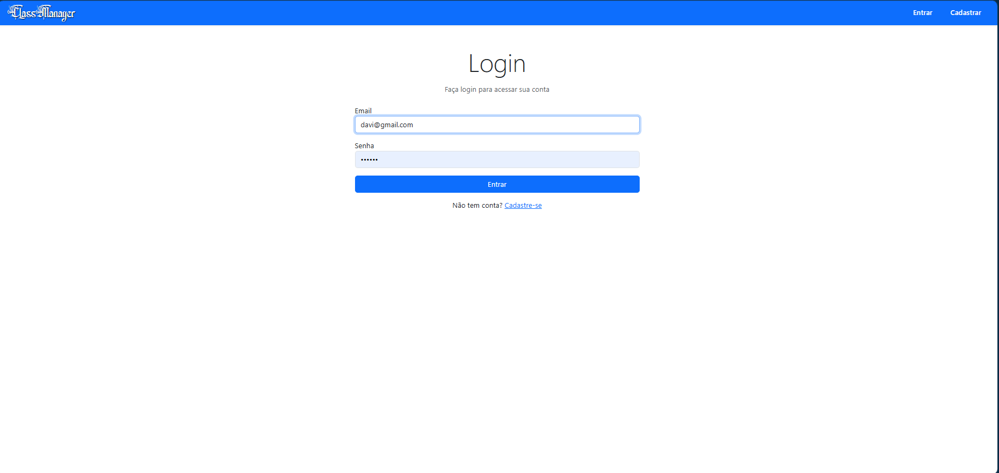
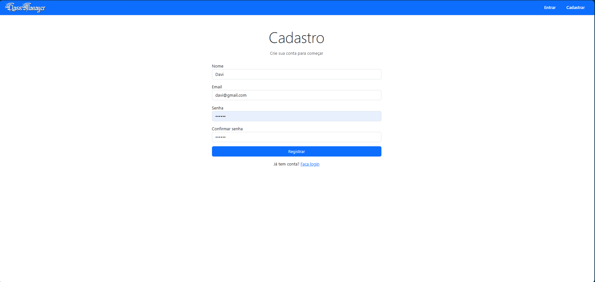
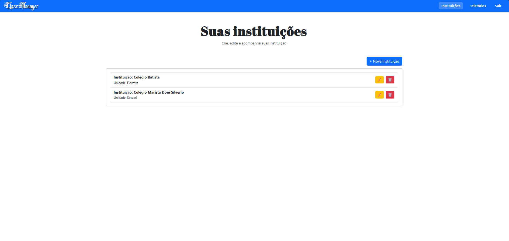
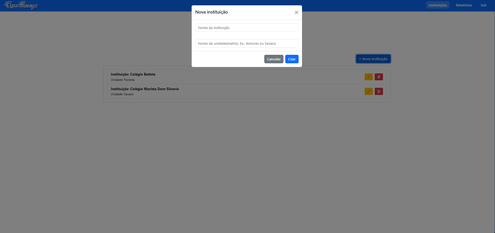
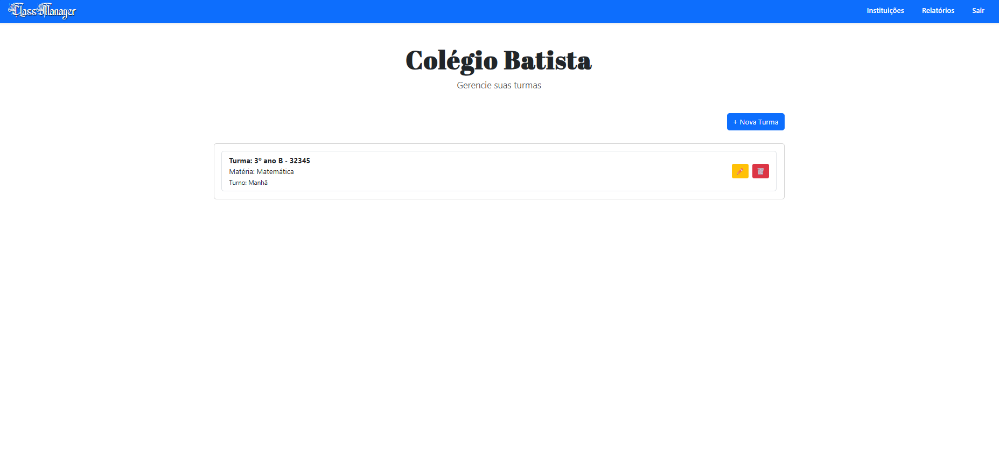
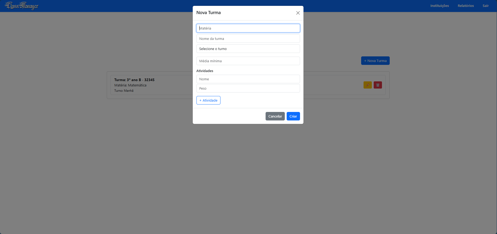
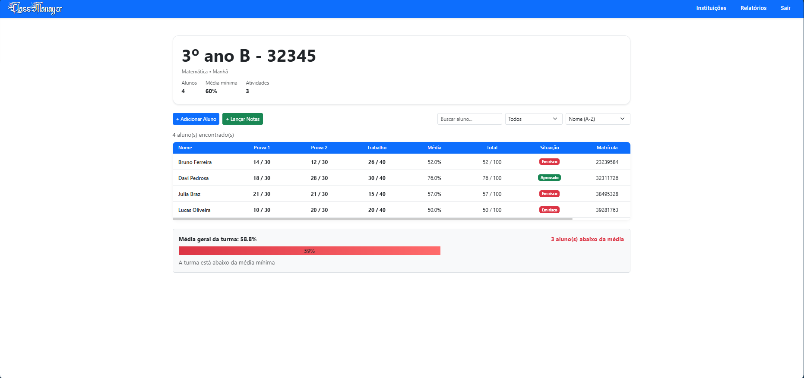
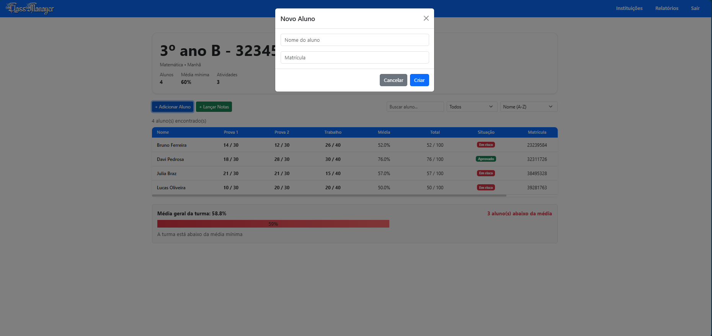
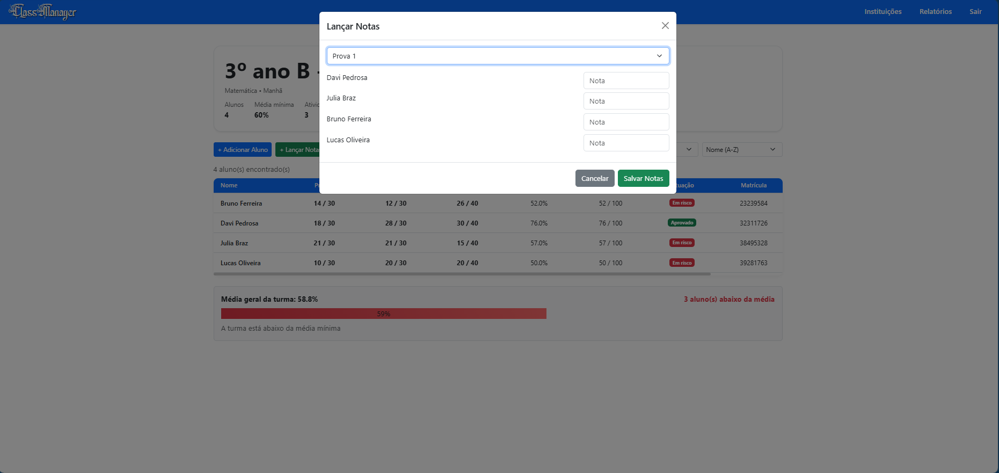
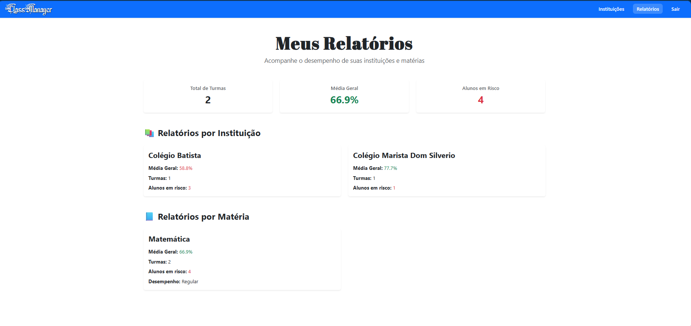

# 📚 ClassManager


Um sistema web para gerenciamento de turmas, alunos e desempenho acadêmico, permitindo que professores acompanhem o progresso dos estudantes de forma organizada e intuitiva.

---

## 🚀 Visão Geral

O ClassManager é uma aplicação web desenvolvida com Node.js e React que permite ao professor:

- Criar e gerenciar turmas
- Cadastrar alunos
- Definir atividades avaliativas com pesos
- Lançar notas
- Acompanhar desempenho com médias e totais
- Filtrar, ordenar e buscar alunos dinamicamente

---

## ✨ Funcionalidades

### 🔐 Autenticação

- Cadastro de usuário
- Login com token JWT
- Proteção de rotas

### 📚 Turmas

- Criação de turmas
- Definição de atividades avaliativas
- Configuração de média mínima

### 👨‍🎓 Alunos

- Cadastro de alunos com nome e matrícula
- Listagem dinâmica
- Edição e exclusão (em evolução)

### 📝 Notas

- Lançamento de notas por atividade
- Validação baseada no peso da atividade
- Atualização em tempo real

### 📊 Análise de Desempenho

- Cálculo de média (%)
- Cálculo de total de pontos
- Exibição de situação (Aprovado / Em risco / Sem avaliação)

### 🔍 Filtros e Ordenação

- Busca por nome
- Ordenação por nome ou média
- Filtro por status

---

## 🎨 Interface

- Layout moderno com React
- Tabela dinâmica com scroll e header fixo
- Coluna fixa para melhor visualização
- Interface responsiva e interativa

---

## 🛠️ Tecnologias Utilizadas

| Tecnologia | Função                |
| ---------- | --------------------- |
| Node.js    | Backend               |
| Express    | API REST              |
| MongoDB    | Banco de dados        |
| Mongoose   | ODM                   |
| React      | Interface frontend    |
| Bootstrap  | Estilização           |
| JWT        | Autenticação          |
| dotenv     | Variáveis de ambiente |

---

## ⚙️ Instalação

```bash
git clone <SEU_REPOSITORIO>
cd <PASTA_DO_PROJETO>
```

### Backend

```bash
cd backend
npm install
```

### Frontend

```bash
cd frontend
npm install
```

---

## 🔧 Configuração do ambiente (.env)

⚠️ IMPORTANTE:
Crie um arquivo `.env` dentro da pasta **backend** com:

```env
MONGO_URI=sua_string_mongodb
JWT_SECRET=sua_chave_secreta
```

### 🧠 Explicação

- **MONGO_URI** → conexão com o MongoDB (usado no `server.js`)
- **JWT_SECRET** → chave de autenticação (usado no `authMiddleware.js`)

---

## ▶️ Executando o projeto

### Backend

```bash
cd backend
npm run dev
```

### Frontend

```bash
cd frontend
npm run dev
```

Acesse:
http://localhost:5173

---

## 🗄️ Banco de Dados

Você pode usar:

### ☁️ MongoDB Atlas (Recomendado)

- Mais simples e utilizado em projetos reais

- Acesse:
  https://www.mongodb.com/atlas

- Crie uma conta
- Crie um cluster gratuito
- Copie a connection string
- Cole no `.env` como `MONGO_URI`

---

### 🖥️ MongoDB Local (Opcional)

- Instale o MongoDB:
  https://www.mongodb.com/try/download/community

- Inicie o servidor:

```bash
mongod
```

---

## 🏗️ Estrutura do Projeto

### Backend

- Controllers
- Models
- Routes
- Middlewares

### Frontend

- Componentes React
- Gerenciamento de estado
- Consumo de API

---

## 🔄 Fluxo da aplicação

1. Usuário interage com o frontend
2. Frontend consome a API
3. Backend processa a lógica
4. Banco armazena dados
5. Interface é atualizada

---

## 💡 Melhorias Futuras

- 📊 Relatórios por instituição
- 📚 Relatórios por matéria (visão global entre turmas)
- 📈 Análise de desempenho mais avançada
- 🎨 Melhorias de UX/UI (feedback visual, animações, experiência do usuário)

---

## 👨‍💻 Autor

Davi Pedrosa

---

## 📄 Licença

MIT

## 📸 Preview do Projeto

### 🔐 Telas de Login e Cadastro





---

### 🏫 Página de Instituições





---

### 📚 Hub de turmas das instituições





---

### 📚 Página da Turma







---

### 📊 Página de Relatórios


